https://youtu.be/e1snsuY4lTI

great video on setting up skills and agents.md need to take some notes on it.

## waylonwalker.com on new builder

new builder watcher, kicks off immediately on commit through websocket connection back to the repo.

## ==plain==down↓ performance

Working on md.waylonwalker.com performance, and I think we are seeing really
  good reponses. Things are moving much quicker with less noticable lag spikes than before, they are not completely gone, but we are really getting there. 󱨛.

!!! note @clanker

    ## Performance
    
    - Moved Markdown parsing to a Web Worker.
    - Delayed preview updates until the editor is idle.
    - Reduced work during typing.
    - Typing now stays responsive while the preview updates.

    ### baseline numbers
    
    - Preview render: 289 ms average
    - Preview render P95: 671 ms
    - Preview render maximum: 769 ms
    - Typing latency P95: 22.6 ms
    - Worst recorded character input: 52 ms
    
Preview performance

``` mermaid
xychart-beta
    title "Preview render time — lower is better"
    x-axis ["Average", "P95"]
    y-axis "Milliseconds" 0 --> 700
    bar [289, 671]
    bar [122, 184]
```
    

### Typing performance

``` mermaid
xychart-beta
    title "Typing latency"
    x-axis ["P50", "P95"]
    y-axis "Milliseconds" 0 --> 25
    bar [8.2, 22.6]
    bar [6.7, 20.4]
```

