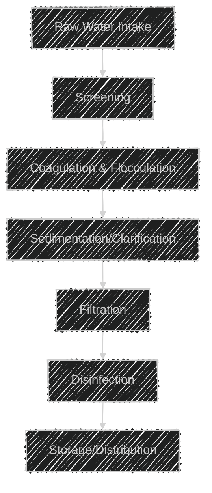
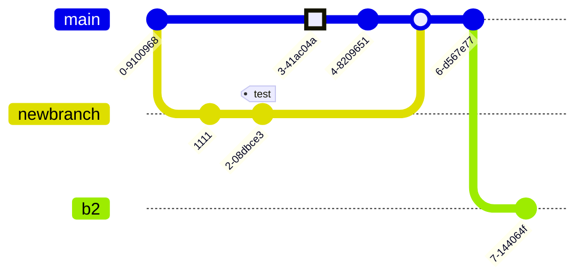

``` python
import this

print("that")
```

# title

## subtitle

!!! note sample note

     this is a sameple

!!! danger be careful

     this is super dang.

     ## subtitle

!!! reminder

     this is a reminder

!!! caution

     this is a caution

!!! attention

     this is a attention

!!! hint

     this is a hint

!!! error

     this is a error

!!! important

     this is a important

!!! seealso

     this is a seealso

!!! tip

     this is a tip

!!! todo

     this is a todo

!!! warning

     this is a warning

!!! settings

     this is a settings

html without the markdown atrribute will not be parsed as markdown

!!! vsplit ""

    !!! vsplit ""
        ``` markdown
        <div>
        # markdown in html

        This is not markdown
        </div>
        ``` markdown

    !!! vsplit ""
        <div>
        # markdown in html

        This is not markdown
        </div>

If you give an html tag the `markdown="1"` attribute, the markdown will be
parsed and rendered as html inside of that tag.

!!! vsplit ""
    !!! vsplit ""
        ``` markdown
        <div markdown="1">

        # markdown in html

        This is a *Markdown* Paragraph.

        </div>
        ```

    !!! vsplit ""
        <div markdown="1">

        # markdown in html

        This is a *Markdown* Paragraph.

        </div>




gitgraph




The journey


<script src="https://cdn.jsdelivr.net/npm/vega@5"></script>

<script src="https://cdn.jsdelivr.net/npm/vega-lite@5"></script>
<script src="https://cdn.jsdelivr.net/npm/vega-embed@6"></script>

```vega
{
  "$schema": "https://vega.github.io/schema/vega-lite/v4.json",
  "data": {"url": "https://vega.github.io/editor/data/barley.json"},
  "mark": "bar",
  "encoding": {
    "x": {"aggregate": "sum", "field": "yield", "type": "quantitative"},
    "y": {"field": "variety", "type": "nominal"},
    "color": {"field": "site", "type": "nominal"}
  }
}
```
