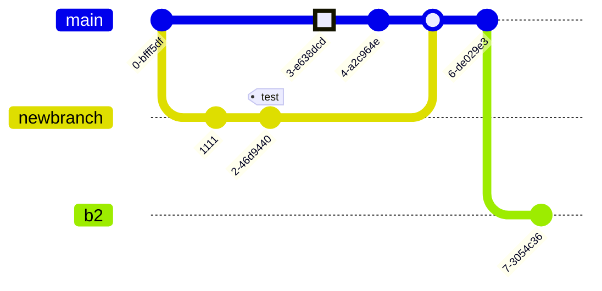

# title

## subtitle

### sub-subtitle

#### sub-sub-subtitle

##### sub-sub-sub-subtitle

###### sub-sub-sub-sub-subtitle

## Paragraph

Lorem ipsum dolor sit amet, consectetur adipiscing elit, sed do eiusmod tempor
incididunt ut labore et dolore magna aliqua. Ut enim ad minim veniam, quis
nostrud exercitation ullamco laboris nisi ut aliquip ex ea commodo consequat.
Duis aute irure dolor in reprehenderit in voluptate velit esse cillum dolore eu
fugiat nulla pariatur. Excepteur sint occaecat cupidatat non proident, sunt in
culpa qui officia deserunt mollit anim id est laborum.

## CodeBlock

``` python
import this

print("that")
```

## Horizontal rule

---

## Blockquote

> Lorem ipsum dolor sit amet, consectetur adipiscing elit, sed do eiusmod
> tempor incididunt ut labore et dolore magna aliqua. Ut enim ad minim veniam,
> quis nostrud exercitation ullamco laboris nisi ut aliquip ex ea commodo
> consequat. Duis aute irure dolor in reprehenderit in voluptate velit esse
> cillum dolore eu fugiat nulla pariatur. Excepteur sint occaecat cupidatat non
> proident, sunt in culpa qui officia deserunt mollit anim id est laborum.

## Table

| Syntax | Description |
| ----------- | ----------- |
| Header | Title |
| Paragraph | Text |

## Task List

- [x] Write the press release
- [ ] Update the website
- [ ] Contact the media

## Highlight

I need to highlight these ==very important words==.

## Bold

This text has **bold** text

## Italics

This text has _italic_ text

## Subscript

``` markdown
H~2~0
```

H~2~O

## Superscript

``` markdown
X^2^
```

X^2^

## Emoji

Emoji support not yet working

``` markdown
That is so funny! :joy:

:rocket:

:thumbs_up:

:grinning_face:

:fire:
```

That is so funny! :joy:

:rocket:

:thumbs_up:

:grinning_face:

:fire:

## Abbreviations

*[HTML]: Hyper Text Markup Language
*[W3C]:  World Wide Web Consortium
The HTML specification
is maintained by the W3C.

## Keys

++Ctrl+Alt+Del++

++Win+9++

## Mark

``` markdown
==marked==
```

==marked==

==marked== => <mark>inserted</mark>

## Containers

::: container {.bg-pink-500}
_here be dragons_

here
:::

warning

{.bg-pink-500}
::: warning
_here be dragons_
be careful
:::

more containers

:::: name
::: name
_markdown_
:::
::::

{.text-pink-900}
::::
{.bg-pink-500}
:::
container

## here

there

## there

``` python
import this
```

:::

:::
second container

I still have pink text, but no pink background
:::

::::

## carousel

{.carousel}
::::
:::
hi
:::
:::
hi
:::
:::
hi
:::
:::
hi
:::
:::
hi
:::
::::

## Admonitions

!!! note sample note

     this is a sample

???+ note sample note

     this is a sample

     it's collapsible and open

??? note sample note

     this is a sample

     it's collapsible and closed

!!! danger be careful

     this is super dang.

     ## subtitle

!!! reminder

     this is a reminder

!!! caution

     this is a caution

!!! attention

     this is a attention

!!! hint

     this is a hint

!!! error

     this is a error

!!! important

     this is a important

!!! seealso

     this is a seealso

!!! tip

     this is a tip

!!! todo

     this is a todo

!!! warning

     this is a warning

!!! settings

     this is a settings

## vsplit

``` markdown
!!! vsplit I Have two opinions

    !!! vsplit Left Opinion

        supporting arguments

        * lorem ipsum
        * ipsum dolor

        - [x] lorem ipsum
        - [ ] ipsum dolor

    !!! vsplit Right Opinion

        supporting arguments

        * lorem ipsum
        * ipsum dolor

        - [ ] lorem ipsum
        - [x] ipsum dolor
```

Here is the result of that markdown.

!!! vsplit I Have two opinions

    !!! vsplit Left Opinion

        supporting arguments

        * lorem ipsum
        * ipsum dolor

        - [x] lorem ipsum
        - [ ] ipsum dolor

    !!! vsplit Right Opinion

        supporting arguments

        * lorem ipsum
        * ipsum dolor

        - [ ] lorem ipsum
        - [x] ipsum dolor

A clean vsplit

{.clean}
!!! vsplit ""

    !!! vsplit Hello World

        Here is a hello world application written in the typer cli framework
        for cli.

    !!! vsplit ""
        ``` python
        #!/usr/bin/env -S uv run --quiet --script
        # ///
        # requires-python = ">=3.12"
        # dependencies = [
        #     "typer",
        # ]
        # ///

        import typer

        app = typer.Typer()

        @app.command()
        def hello(name: str = "World"):
            """Prints a greeting message."""
            typer.echo(f"Hello, {name}!")

        if __name__ == "__main__":
            app()
        ```

## html in md

html without the markdown atrribute will not be parsed as markdown

!!! vsplit ""

    !!! vsplit ""
        ``` markdown
        <div>
        # markdown in html

        This is not markdown
        </div>
        ```

    !!! vsplit ""
        <div>
        # markdown in html

        This is not markdown
        </div>

If you give an html tag the `markdown="1"` attribute, the markdown will be
parsed and rendered as html inside of that tag.

!!! vsplit ""
    !!! vsplit ""
        ``` markdown
        <div markdown="1">

        # markdown in html

        This is a *Markdown* Paragraph.

        </div>
        ```

    !!! vsplit ""
        <div markdown="1">

        # markdown in html

        This is a *Markdown* Paragraph.

        </div>

## mermaid diagrams


gitgraph




The journey


```` markdown

````


## can it vsplit

!!! vsplit ""
    !!! vsplit ""
        ```` markdown
        ``` mermaid
        architecture-beta
            group api[logos:aws-lambda](API)

            service db(logos:aws-aurora)[Database] in api
            service disk1(logos:aws-glacier)[Storage] in api
            service disk2(logos:aws-s3)[Storage] in api
            service server(logos:aws-ec2)[Server] in api

            db:L -- R:server
            disk1:T -- B:server
            disk2:T -- B:db
        ```
        ````

    !!! vsplit ""
        ``` mermaid
        architecture-beta
            group api(logos:aws-lambda)[API]

            service db(logos:aws-aurora)[Database] in api
            service disk1(logos:aws-glacier)[Storage] in api
            service disk2(logos:aws-s3)[Storage] in api
            service server(logos:aws-ec2)[Server] in api

            db:L -- R:server
            disk1:T -- B:server
        ```
