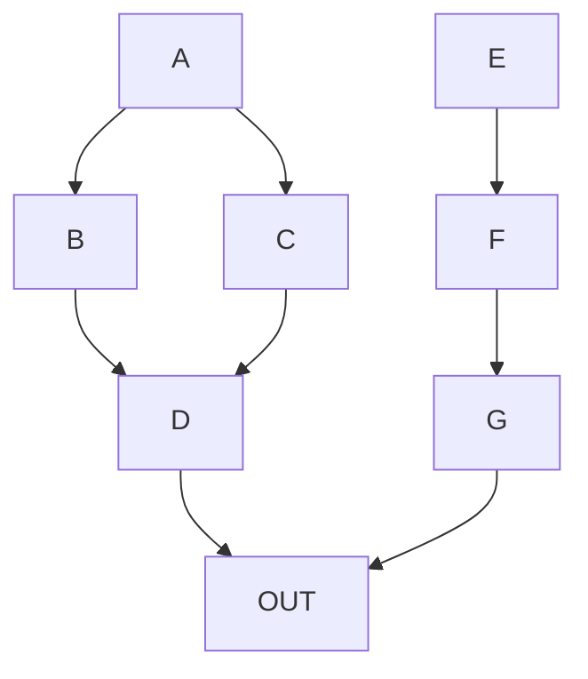
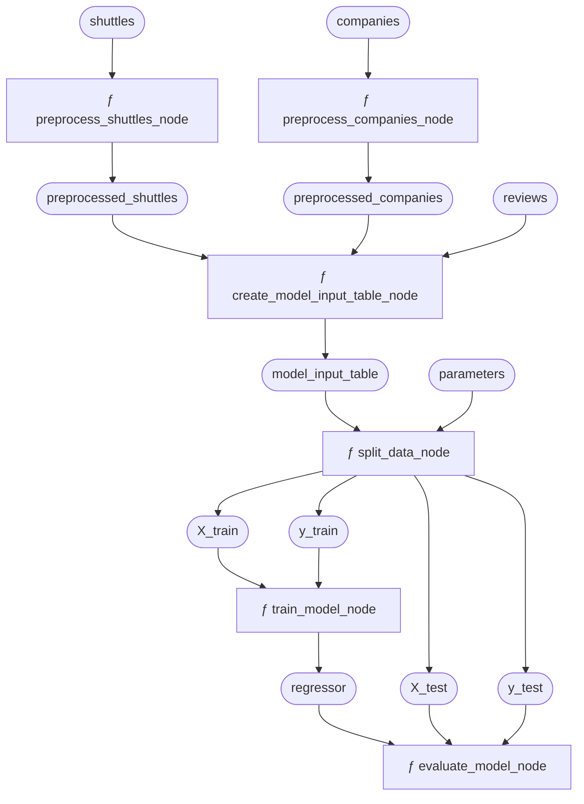
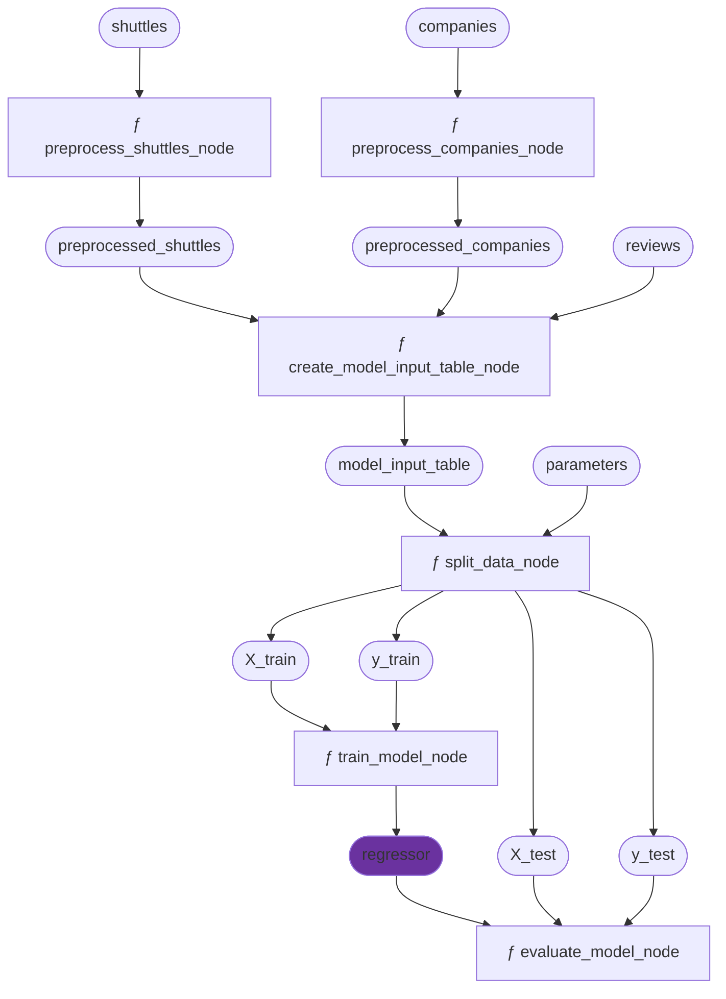

## example

```mermaid
  graph TD;
      A-->B;
      A-->C;
      B-->D;
      C-->D-->OUT;
      E-->F-->G-->OUT
      
```

```mermaid
graph TD;
shuttles([shuttles]) -->preprocess_shuttles_node[ ƒ preprocess_shuttles_node]
preprocess_shuttles_node[ƒ preprocess_shuttles_node] --> preprocessed_shuttles([preprocessed_shuttles])
companies([companies]) -->preprocess_companies_node[ ƒ preprocess_companies_node]
preprocess_companies_node[ƒ preprocess_companies_node] --> preprocessed_companies([preprocessed_companies])
preprocessed_shuttles([preprocessed_shuttles]) -->create_model_input_table_node[ ƒ create_model_input_table_node]
preprocessed_companies([preprocessed_companies]) -->create_model_input_table_node[ ƒ create_model_input_table_node]
reviews([reviews]) -->create_model_input_table_node[ ƒ create_model_input_table_node]
create_model_input_table_node[ƒ create_model_input_table_node] --> model_input_table([model_input_table])
model_input_table([model_input_table]) -->split_data_node[ ƒ split_data_node]
parameters([parameters]) -->split_data_node[ ƒ split_data_node]
split_data_node[ƒ split_data_node] --> X_train([X_train])
split_data_node[ƒ split_data_node] --> X_test([X_test])
split_data_node[ƒ split_data_node] --> y_train([y_train])
split_data_node[ƒ split_data_node] --> y_test([y_test])
X_train([X_train]) -->train_model_node[ ƒ train_model_node]
y_train([y_train]) -->train_model_node[ ƒ train_model_node]
train_model_node[ƒ train_model_node] --> regressor([regressor])
regressor([regressor]) -->evaluate_model_node[ ƒ evaluate_model_node]
X_test([X_test]) -->evaluate_model_node[ ƒ evaluate_model_node]
y_test([y_test]) -->evaluate_model_node[ ƒ evaluate_model_node]


```

```mermaid
graph TD;
shuttles([shuttles]) -->preprocess_shuttles_node[ ƒ preprocess_shuttles_node]
preprocess_shuttles_node[ƒ preprocess_shuttles_node] --> preprocessed_shuttles([preprocessed_shuttles])
companies([companies]) -->preprocess_companies_node[ ƒ preprocess_companies_node]
preprocess_companies_node[ƒ preprocess_companies_node] --> preprocessed_companies([preprocessed_companies])
preprocessed_shuttles([preprocessed_shuttles]) -->create_model_input_table_node[ ƒ create_model_input_table_node]
preprocessed_companies([preprocessed_companies]) -->create_model_input_table_node[ ƒ create_model_input_table_node]
reviews([reviews]) -->create_model_input_table_node[ ƒ create_model_input_table_node]
create_model_input_table_node[ƒ create_model_input_table_node] --> model_input_table([model_input_table])
model_input_table([model_input_table]) -->split_data_node[ ƒ split_data_node]
parameters([parameters]) -->split_data_node[ ƒ split_data_node]
split_data_node[ƒ split_data_node] --> X_train([X_train])
split_data_node[ƒ split_data_node] --> X_test([X_test])
split_data_node[ƒ split_data_node] --> y_train([y_train])
split_data_node[ƒ split_data_node] --> y_test([y_test])
X_train([X_train]) -->train_model_node[ ƒ train_model_node]
y_train([y_train]) -->train_model_node[ ƒ train_model_node]
train_model_node[ƒ train_model_node] --> regressor([regressor])
regressor([regressor]) -->evaluate_model_node[ ƒ evaluate_model_node]
X_test([X_test]) -->evaluate_model_node[ ƒ evaluate_model_node]
y_test([y_test]) -->evaluate_model_node[ ƒ evaluate_model_node]

style regressor fill:#6a329f
```
